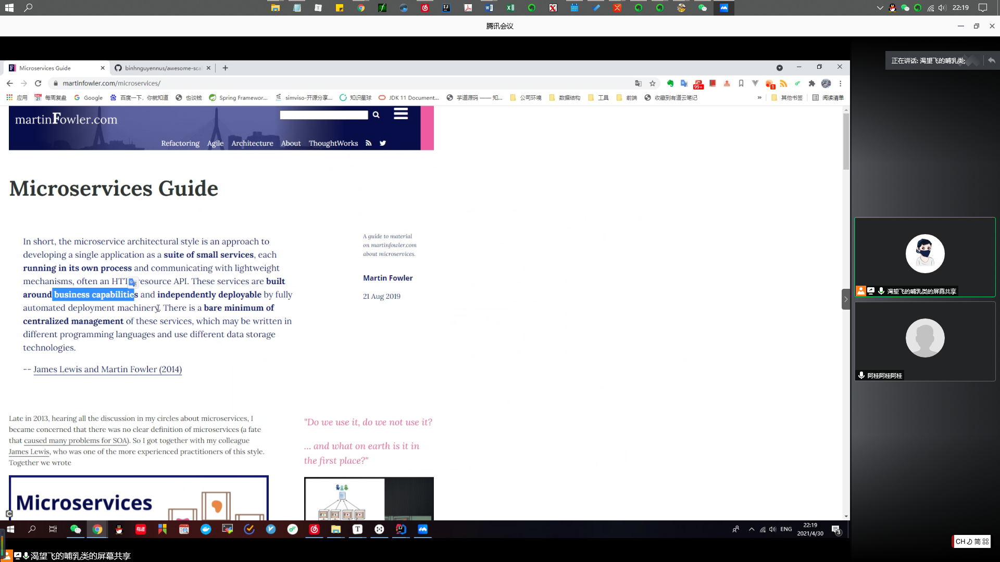

## 初衷

1. 通过约定时间分享，养成高质量学习的习惯

2. 不局限于自我学习，分享与交流，让自己能够把技术、知识点表达出来

3. 多表达了才能够理清楚思路，多交流才能碰撞出新的想法

   

## 建议

1. 知识点是容易忘的，源码是容易遗忘的，所以需要多画图，方便让以后的自己或者其他人能够对知识点立马有个整体意识
2. 先落地，先行动，后完善，先养成习惯，后一点点找感觉，把讲的内容提高起来

## 自我批评

1. 知识点不够深入、需要提前做好功课

2. 需要往一些有利的亮点深入，例如：https，web安全漏洞、首部字段中range的断点续传、隧道

   

## 一些展望

1. 有规划有方向的提高质量，录视频
2. 形成习惯后，档次提高之后，加人

