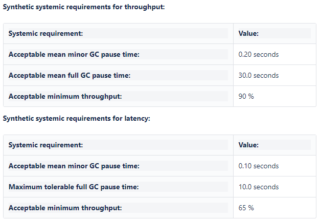
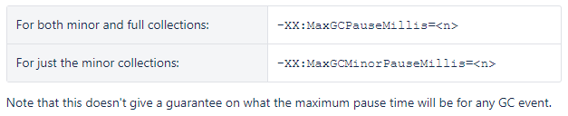

## 一、八种应用系统的性能指标

### 1. 用户满意度分数（Apdex）

应用性能指数或者Apdex分数，是一种追踪应用反应性能的行业标准。工作原理：指定特定 Web 请求或事务【应当】花费多长时间的【目标】，并对其进行打分：这些事务可以分为：1. 满意（快速）=1个事务、2. 可容忍（缓慢）=半个事务、3. 太慢和失败=0个事务
应用通过一个数学公式来表示，分数范围是0~1

### 2. 平均响应时间

更推荐Apdex来追踪性能问题，单纯看平均响应时间并不太实际。

### 3. 错误率

监控错误率也是一个应用的重要性能指标

- HTTP 错误：web请求错误的个数
- 日志异常： 在应用中未处理的，打印出来的异常日志
- 抛出异常： 所有抛出的异常

### 4. 应用实例的个数

对于自动向上或向下扩展的云服务，应用实例的个数也就成为一个重要的参考指标。

自动伸缩可以帮助应用按需伸缩同时也能在飞峰值时节省资源（这也存在一些监控上的问题）。

### 5. 请求率

应用接收了多少流量，请求率可以根据和其他的性能指标结合起来，显示出是如何动态扩展的。略有不同的指标就是追踪并发用户量

### 6. 应用和服务器的CPU

如果CPU使用率特别高，居高不下，那么应用肯定有性能问题。

### 7. 应用可用性

监控应用是否在线和可用，最简单的方式就是设置几个定时任务来检查HTTP，是否可用。

### 8. 垃圾回收

垃圾收集发生时，可能导致进程的挂起，并可能使用大量 CPU，一个隐藏的性能问题

### 扩展与总结

扩展-监控产品：

1. ARMS：https://help.aliyun.com/document_detail/111034.html
2. 微服务监控：https://blog.csdn.net/Jmilk/article/details/108431643
3. skywalking：https://github.com/apache/skywalking、https://niyanchun.com/skywalking-introduction.html、https://www.upyun.com/opentalk/334.html
4. Prometheus：https://prometheus.io/、https://www.aneasystone.com/archives/2018/11/prometheus-in-action.html

8大标准衡量性能问题是比较全面的，很多监控产品也都基本能满足对应指标的检测。

## 二、[垃圾收集(GC)优化指南](https://confluence.atlassian.com/enterprise/garbage-collection-gc-tuning-guide-461504616.html)

### 1. 性能目标

类似CAP原则

- 延迟（垃圾收集引起的暂停时间）
  - 平均停顿时间
  - 最长暂停时间
- 吞吐量（应用程序的执行时间总时长）
- 分配的堆内存

### 2. 垃圾收集原则

- Minor GC优先，成本更低
- 内存最大化，内存越多会更好（从性能调优的角度来看这并不一定）
- 性能目标 三选二

### 3. GC调优的环境准备

- 使用工作加载JVM的应用程序
- 打开 GC 日志记录
  - +PrintGC -XX:+PrintGCDetails -XX:+PrintGCTimeStamps -Xloggc:<file>
- 设置数据采样范围（稳定状态）
- 确定内存占用
- 分代大小的经验（这个还是得自己去结合实际，demo试试）
  - 最大堆的大小：老年代平均值的3~4倍
  - 老年代的大小：>老年代平均值的1.5倍（GC日志有直接计算平均值吗？）
  - 永久代的大小：>永久代平均值的1.5倍
  - 新生代的大小：>整个堆的10%（TODO）
- 确定系统要求

[美团技术团队参考](https://tech.meituan.com/2017/12/29/jvm-optimize.html)

### 4. 了解吞吐量收集器和基于行为的调优

- 基于行为的调整目标
  - 最大暂停时间目标
    
  - 吞吐量目标
    
  - 最大堆目标：-Xms<n>[g|m|k] -Xmx<n>[g|m|k]
- 目标之间的相互作用

## 三、[高吞吐量和低延迟 Java 应用程序的垃圾收集优化](https://engineering.linkedin.com/garbage-collection/garbage-collection-optimization-high-throughput-and-low-latency-java-applications)

参考文档：

1. https://mechanical-sympathy.blogspot.com/2013/07/java-garbage-collection-distilled.html
2. https://eng.uber.com/jvm-tuning-garbage-collection/
3. https://www.oracle.com/technetwork/java/javase/memorymanagement-whitepaper-150215.pdf

## 四、[高吞吐量、低延迟，机器学习服务](https://medium.com/adobetech/engineering-high-throughput-low-latency-machine-learning-services-7d45edac0271)

### 1. 应用性能瓶颈

1. 需要计算API的吞吐量和延迟
2. 算法的时间和空间复杂度高
3. AI的最大模型尺寸和最大模型数量
4. API契约（restful、form）
5. 使用的系统（主机大小、内存、网络带宽）
6. 需要生成日志记录、监控、反馈和模型

### 2. 代码分析

perf (Linux)和 DTrace (Mac OS x)

- 收集包含堆栈跟踪的配置文件数据
- CPU 的火焰图形，可视化每个方法调用

### 3. JMH 微基准测试

1. JVM预热
2. 代码优化路径

### 4. Jmeter

1. 平均响应时间
2. 99%延迟等（看了不少文章会注重95和99的性能）
3. 请求线程的数量、连接重用、随机请求和恒定吞吐量计时器

### 5. 日志记录、反馈和模型评估的事件

1. 为每个请求创建一个事件
2. 在出现异常、模型刷新和服务初始化的情况下，还会出现日志事件

### 参考

火焰图：http://www.brendangregg.com/blog/images/2014/cpu-vertx-flamegraph.svg
perf的介绍：http://www.brendangregg.com/FlameGraphs/cpuflamegraphs.html
perf的使用：https://www.cnblogs.com/arnoldlu/p/6241297.html
perf生成java程序的火焰图：https://www.cnblogs.com/CarpenterLee/p/7467283.html
JMH基准测试的官方Demo：http://hg.openjdk.java.net/code-tools/jmh/file/tip/jmh-samples/src/main/java/org/openjdk/jmh/samples/
JMH使用介绍：https://www.xncoding.com/2018/01/07/java/jmh.html
disruptor：https://github.com/LMAX-Exchange/disruptor/wiki